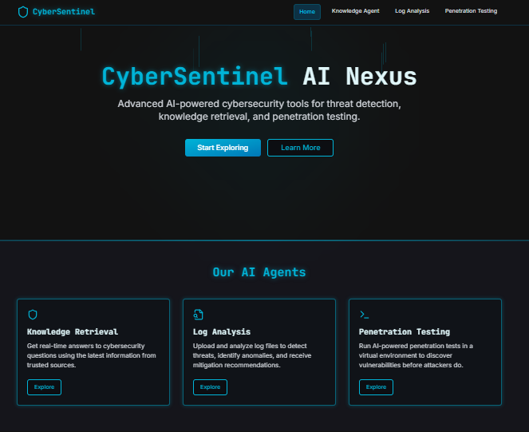
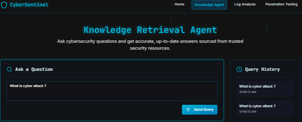
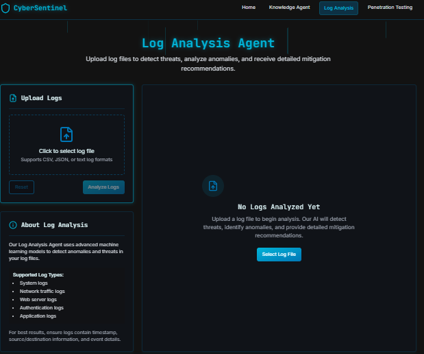
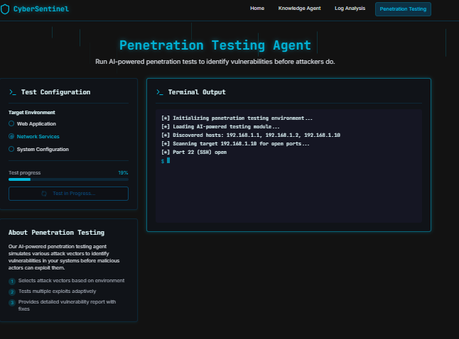

* The **main website screenshot** (`images/webpage.png`)
* Section previews for: Knowledge Retrieval Agent (`Kra.png`), Log Analysis Agent (`la.png`), and Penetration Testing Agent (`pt.png`)

---

````markdown
# 🚨 CyberSentinel AI Nexus



**CyberSentinel AI Nexus** is an advanced AI-powered cybersecurity platform providing real-time threat detection, knowledge retrieval, and penetration testing capabilities. Our suite of intelligent agents empowers users with powerful, accessible, and secure tools for cybersecurity analysis and defense.

---

## 🚀 Features

### 🔍 Knowledge Retrieval

Gain real-time responses to cybersecurity questions using the latest information from trusted sources.



### 📂 Log Analysis

Upload and analyze log files using AI to detect threats, security misconfigurations, and receive mitigation recommendations.



### 🧪 Penetration Testing

Run AI-powered penetration tests to simulate attacks and discover vulnerabilities before adversaries do.



---

## 🤖 Our AI Agents

| Agent               | Description                                                                   |
| ------------------- | ----------------------------------------------------------------------------- |
| **Knowledge Agent** | Real-time intelligence from trusted sources for quick cybersecurity insights. |
| **Log Analyzer**    | Advanced analysis using machine learning to detect threats from log files.    |
| **PenTester**       | Adaptive testing that simulates potential exploits to detect vulnerabilities. |

---

## 🧠 Why Choose CyberSentinel?

- **Real-time Intelligence**: Access the latest global cybersecurity threat intelligence.
- **Advanced Analysis**: Leverage ML models for log and behavioral analysis.
- **Adaptive Testing**: Simulate real-world threats for preemptive vulnerability detection.

---

## 📦 Installation

```bash
git clone https://github.com/your-username/cybersentinel.git
cd cybersentinel
npm install
npm start
````

Or for Python (if applicable):

```bash
pip install -r requirements.txt
python app.py
```

---

## 🛠️ Usage

1. Launch the platform.
2. Choose one of the AI Agents (Knowledge Retrieval, Log Analysis, Penetration Testing).
3. Interact via the intuitive UI to get insights or upload data.
4. View reports and recommendations.

---

## 📄 License

This project is licensed under the MIT License - see the [LICENSE](LICENSE) file for details.

---

## 🙌 Acknowledgments

* OpenAI / Hugging Face for language models
* OWASP for cybersecurity guidelines
* Community testers and contributors

```

---

Let me know if you'd like to auto-generate HTML or GitHub badges (like version, language, license, or build status).
```

